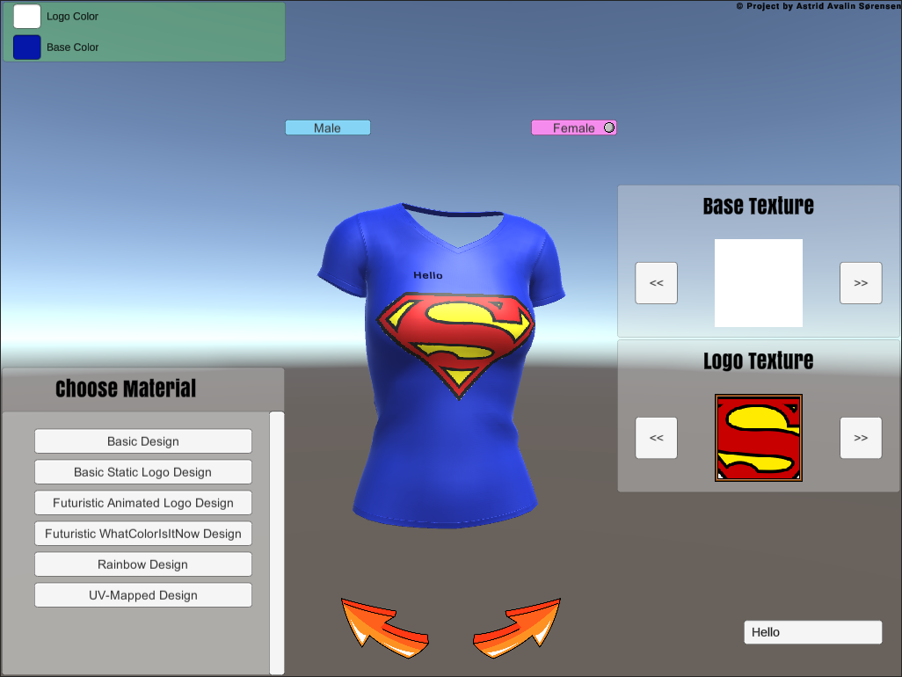

# T-Shirt Creator Kit

  

## About
A Unity project experimenting with shaders and UV mapping.
Works with Unity 2020.1.8f1.

## Download and Installation
To get this project:

* Clone the repo: `git clone https://github.com/Avalin/t_shirt_creator_kit.git`

That's it.

## Usage

Open with a Unity Editor, preferably 2020.1.8f1 or similar. 

## Copyright and License

MIT License

Copyright © 2020 Astrid Avalin Sørensen
